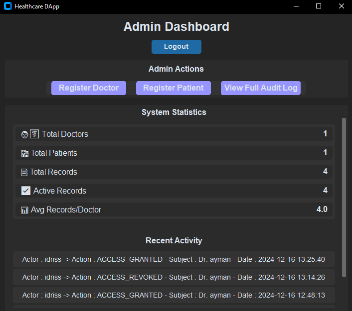
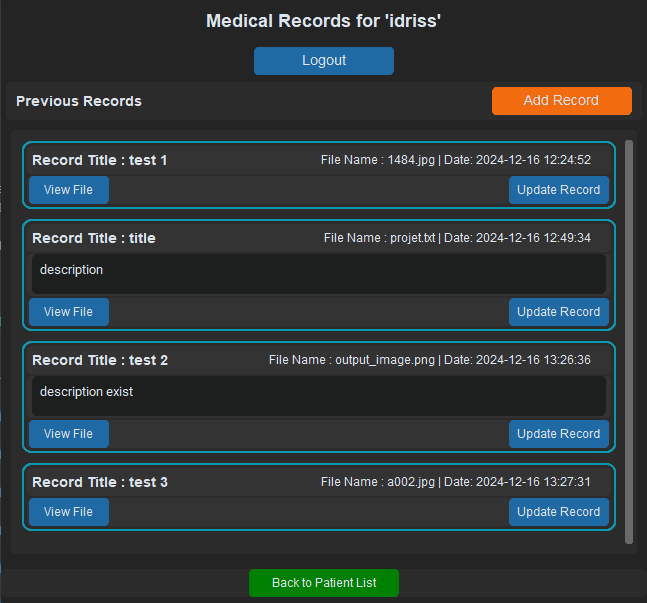
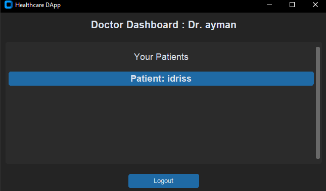

# Tkinter App

## functionalities : 

- admin : 
    - autentificatien (the owner of the contract)
    - can add doctor or patient to the blockchain using it account
    - can view all actions that are happining in the blockchain

- doctor : 
    - autentificatien
    - can add new medical File
    - can read and edit the medical File

- patient :
    - autentificatien 
    - can only view his medical folder
    - can autorize the doctor 

---

## Running The Desktop Application

### Prerequisites
- python 3.x

### Steps
1. Install to the Depandencis 
   ```bash
   git clone https://github.com/drisskhattabi6/Medical-Record-With-Blockchain.git
   cd 'Desktop App'
   ```

2. Install requirements
    ```bash
   pip install -r requirements.txt
   ```

3. run the app:
   ```bash
   python main.py
   ```

## There are some screenshoots : 

Admin Page : 



Doctor Page : 





Patient Page : 

