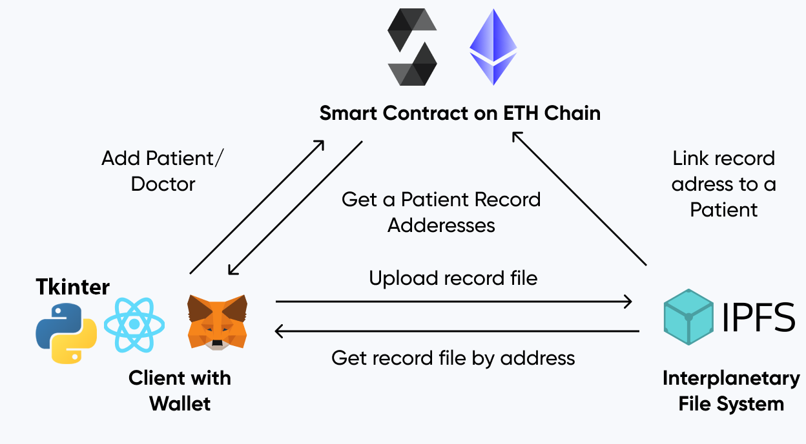
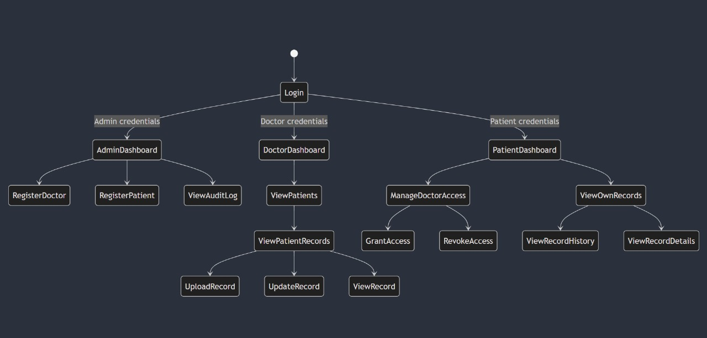
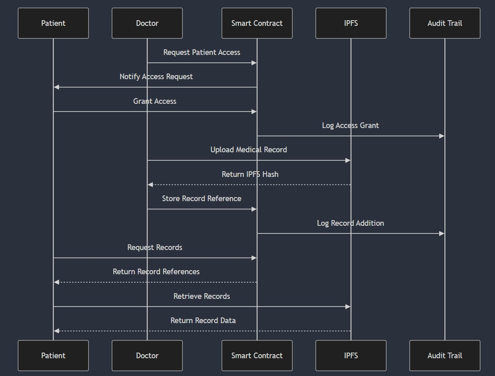
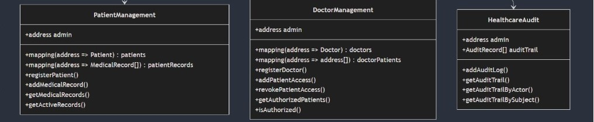
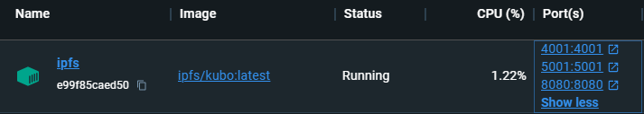

# Medical Document Management Blockchain System


## Brief Description

An innovative medical document management solution utilizing blockchain and IPFS technologies to ensure security, confidentiality, and traceability of medical records.





Sequence Digram


the Contracts : 



### Applications

#### Web Application (ReactJS)
A responsive web application enabling patients, doctors, and administrators to securely manage and access medical documents. Features blockchain wallet authentication, an intuitive interface, and granular access control system.

#### Desktop Application (Tkinter/CustomTkinter)
A cross-platform desktop version offering identical functionalities to the web application. Supports username/password authentication, compatible with Windows, macOS, and Linux, with automatic document opening in native applications.

### Key Features
- Decentralized medical document storage
- Patient-controlled access management
- Comprehensive action traceability
- Transparent audit system
- Automatic document opening mechanism

### Technologies
- Blockchain: Ethereum
- Storage: IPFS
- Web Frontend: React.js
- Desktop Frontend: Tkinter, CustomTkinter
- Languages: Python, JavaScript, Solidity

A system that revolutionizes medical document management by placing patient security and control at the core of technological innovation.


## Project Setup Guide

This guide provides step-by-step instructions for setting up Hardhat, deploying smart contracts using Remix IDE and running IPFS with Docker.
---

## 1. Setting Up Hardhat

### Prerequisites
- Node.js (v16 or later)
- npm or yarn

### Installation Steps
1. Create a new project directory:
   ```bash
   mkdir hardhat-project && cd hardhat-project
   ```

2. Initialize a new Node.js project:
   ```bash
   npm init -y
   ```

3. Install Hardhat:
   ```bash
   npm install --save-dev hardhat
   ```

4. Initialize a Hardhat project:
   ```bash
   npx hardhat
   ```
   - Choose `Create a basic sample project`.
   - Follow the prompts to set up your project.

5. Install dependencies for testing and development:
   ```bash
   npm install @nomicfoundation/hardhat-toolbox
   ```

### Running Hardhat Local Node
Start a local blockchain:
```bash
npx hardhat node
```

### Deploying Contracts
1. Create or modify your smart contract in the `contracts` folder.
2. Write a deployment script in the `scripts` folder.
3. Deploy the contract:
   ```bash
   npx hardhat run scripts/deploy.js --network localhost
   ```


## 2. Deploying Smart Contracts with Remix IDE

### Prerequisites
- Browser with MetaMask installed.

### Steps
1. Open [Remix IDE](https://remix.ethereum.org/).
2. Create a new file under the `contracts` folder and write your smart contract.
3. Compile the contract using the `Solidity Compiler` plugin.
4. Deploy the contract:
   - Go to the `Deploy & Run Transactions` plugin.
   - Choose your environment (`Injected Web3` for MetaMask or another preferred environment).
   - Deploy your contract by selecting it and clicking the `Deploy` button.


**⚠️** **Warning:**  :

**You will need the contracts addresses and ABI for each contract to connect them with the Applications**

---
## 3. Running IPFS in Docker

### Prerequisites
- Docker installed on your machine.

### Steps
1. Pull the IPFS Docker image:
   ```bash
   docker pull ipfs/kubo
   ```

2. Run the IPFS container:
   ```bash
   docker run -d --name ipfs_node -v ipfs_data:/data/ipfs -p 4001:4001 -p 5001:5001 -p 8080:8080 ipfs/kubo
   ```
   - `-v ipfs_data:/data/ipfs`: Persistent storage for IPFS data.
   - `-p 4001:4001`: Peer-to-peer communication.
   - `-p 5001:5001`: API access.
   - `-p 8080:8080`: Gateway access.

3. modify the API Configuration :

go to your container, enter to the files, data/IPFS/config : 
```
"API": {
    "HTTPHeaders": {
      "Access-Control-Allow-Origin": ["*"]
    }
  },
```



---

You will need those setups to run the Desktop App and The Web App, you will find the instruction of running each app in their folder.

----
Note : the Desktop APP and The Web APP are using the same Contracts (contracts addresses and ABI), and the same IPFS.

## Troubleshooting

### Hardhat
- Ensure Node.js and npm versions are compatible.
- Use `npx hardhat clean` to clear the cache if issues arise.

### Remix IDE
- Make sure MetaMask is configured with the correct network.

### IPFS in Docker
- Ensure Docker is running.
- Check container logs for errors: `docker logs ipfs_node`.
