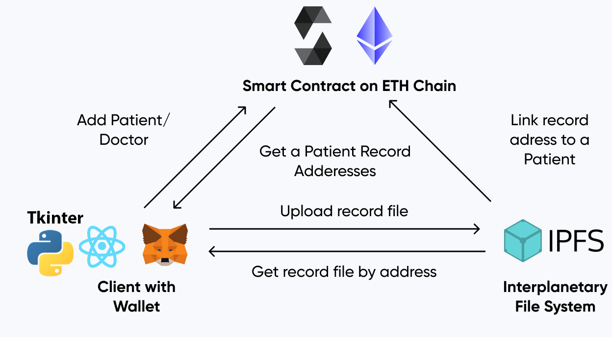
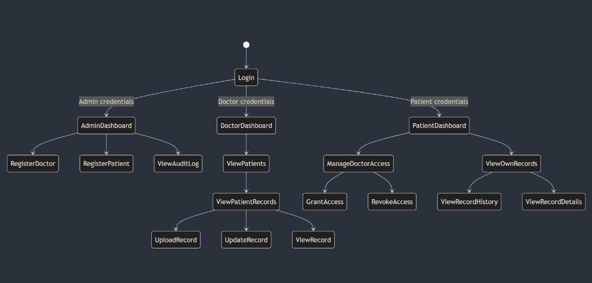
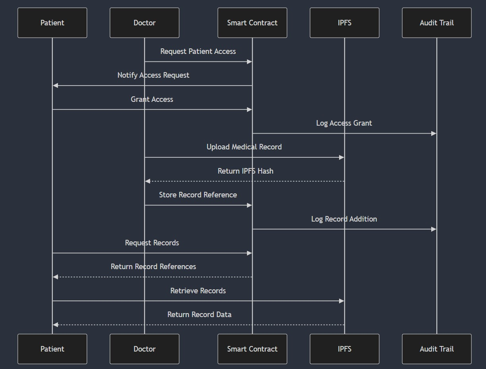
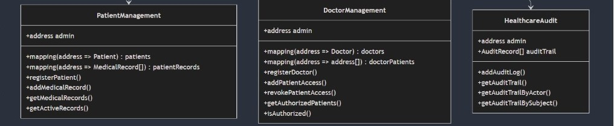

# Medical Document Management Blockchain System


## Brief Description

An innovative medical document management solution utilizing blockchain and IPFS technologies to ensure security, confidentiality, and traceability of medical records.




Sequence Diagram


The Contracts:


---

## Key Features

- **Decentralized medical document storage** — documents stored on IPFS, hashes anchored on Ethereum
- **Client-side AES-GCM encryption** — documents are encrypted in the browser before upload; privacy is maintained even on public IPFS gateways
- **Patient-controlled access management** — patients grant/revoke doctor access at any time
- **Comprehensive action traceability** — every action logged to an immutable audit trail
- **Transparent audit system** — on-chain audit logs for full accountability
- **Gas cost benchmarking suite** — full performance analysis with charts and reports
- **Optimized & Upgradeable contract architecture** — UUPS Proxy pattern for IdentityRegistry, ConsentLedger, RecordRegistry

---

## Applications

### Web Application (ReactJS)
A responsive web application enabling patients, doctors, and administrators to securely manage and access medical documents. Features blockchain wallet authentication (MetaMask), an intuitive interface, and granular access control system.

## Technologies

| Layer | Technology |
|-------|-----------|
| **Blockchain** | Ethereum (Solidity 0.8.20, Hardhat) |
| **Storage** | IPFS (Kubo via Docker) |
| **Web Frontend** | React.js |
| **Smart Contracts** | Solidity |
| **Benchmarking** | Hardhat scripts, QuickChart API |
| **Languages** | Python, JavaScript, Solidity |

---

## Smart Contracts

| Contract | Purpose | Key Operations |
|----------|---------|----------------|
| **PatientManagement** | Patient registration + medical record storage | `registerPatient`, `addMedicalRecord`, `getMedicalRecords` |
| **DoctorManagement** | Doctor registration + access control | `registerDoctor`, `addPatientAccess`, `revokePatientAccess` |
| **HealthcareAudit** | Immutable audit trail logging | `addAuditLog`, `getAuditTrail` |

Medical documents (PDFs, images, reports) are stored on **IPFS**. Only the IPFS content hash (CID) and metadata are stored on-chain — this keeps gas costs manageable regardless of document size.

---

## 📚 Documentation Guide

All project documentation is organized across the repository. Use the links below to navigate to the relevant guides:

### Architecture & Analysis

| Document | Description | Path |
|----------|-------------|------|
| **Gas Cost Analysis** | Detailed gas cost measurements, IPFS performance, scalability analysis, and cost comparisons (Ethereum vs Polygon vs AWS) | [`blockchain/docs/gas-cost-analysis.md`](./blockchain/docs/gas-cost-analysis.md) |
| **Benchmark Suite Guide** | How to run the benchmarking pipeline, methodology, configuration, output files, and troubleshooting | [`blockchain/BENCHMARKS.md`](./blockchain/BENCHMARKS.md) |
| **Access Revocation Flow** | End-to-end documentation of patient revoking doctor access across smart contract and web app layers | [`revocation.md`](./revocation.md) |
| **Security Audit Report** | Deep-dive into critical fixes including UUPS proxy pattern and client-side AES encryption | [`audit_report.md`](./audit_report.md) |

### Application Setup

| Document | Description | Path |
|----------|-------------|------|
| **Web App README** | Running the React web application, features per role (admin, doctor, patient), and screenshots | [`Web App/README.md`](./Web%20App/README.md) |

### Benchmark Data & Reports

| Document | Description | Path |
|----------|-------------|------|
| **Benchmark Report** | Auto-generated markdown report with all benchmark results | [`blockchain/data/benchmark-report.md`](./blockchain/data/benchmark-report.md) |
| **Gas Cost CSV** | Raw gas cost data per operation | [`blockchain/data/gas-costs.csv`](./blockchain/data/gas-costs.csv) |
| **Gas Price Sensitivity CSV** | Cost at varying gas prices (5–200 gwei) | [`blockchain/data/gas-price-sensitivity.csv`](./blockchain/data/gas-price-sensitivity.csv) |
| **IPFS Performance CSV** | Upload/retrieval times by file size | [`blockchain/data/ipfs-performance.csv`](./blockchain/data/ipfs-performance.csv) |
| **Scalability CSV** | Concurrent user performance results | [`blockchain/data/scalability.csv`](./blockchain/data/scalability.csv) |
| **Charts (PNGs)** | Visual charts for gas costs, IPFS performance, cost comparisons, and more | [`blockchain/data/charts/`](./blockchain/data/charts/) |

---

## Project Setup Guide

This guide provides step-by-step instructions for setting up Hardhat, deploying smart contracts using Remix IDE, and running IPFS with Docker.

### 1. Setting Up Hardhat

#### Prerequisites
- Node.js (v16 or later)
- npm or yarn

#### Installation Steps

1. Create a new project directory:
   ```bash
   mkdir hardhat-project && cd hardhat-project
   ```

2. Initialize a new Node.js project:
   ```bash
   npm init -y
   ```

3. Install Hardhat:
   ```bash
   npm install --save-dev hardhat
   ```

4. Initialize a Hardhat project:
   ```bash
   npx hardhat
   ```
   - Choose `Create a basic sample project`.
   - Follow the prompts to set up your project.

5. Install dependencies for testing and development:
   ```bash
   npm install @nomicfoundation/hardhat-toolbox
   ```

#### Running Hardhat Local Node
Start a local blockchain:
```bash
npx hardhat node
```

#### Deploying Contracts
1. Create or modify your smart contract in the `contracts` folder.
2. Write a deployment script in the `scripts` folder.
3. Deploy the contract:
   ```bash
   npx hardhat run scripts/deploy.js --network localhost
   ```

---

### 2. Deploying Smart Contracts with Remix IDE

#### Prerequisites
- Browser with MetaMask installed.

#### Steps
1. Open [Remix IDE](https://remix.ethereum.org/).
2. Create a new file under the `contracts` folder and write your smart contract.
3. Compile the contract using the `Solidity Compiler` plugin.
4. Deploy the contract:
   - Go to the `Deploy & Run Transactions` plugin.
   - Choose your environment (`Injected Web3` for MetaMask or another preferred environment).
   - Deploy your contract by selecting it and clicking the `Deploy` button.

> **⚠️ Warning:** You will need the contract addresses and ABI for each contract to connect them with the applications.

---

### 3. Running IPFS in Docker

#### Prerequisites
- Docker installed on your machine.

#### Steps
1. Pull the IPFS Docker image:
   ```bash
   docker pull ipfs/kubo
   ```

2. Run the IPFS container:
   ```bash
   docker run -d --name ipfs_node -v ipfs_data:/data/ipfs -p 4001:4001 -p 127.0.0.1:5001:5001 -p 127.0.0.1:8080:8080 ipfs/kubo
   ```
   - `-v ipfs_data:/data/ipfs`: Persistent storage for IPFS data.
   - `-p 4001:4001`: Peer-to-peer communication.
   - `-p 127.0.0.1:5001:5001`: Loopback-only API access.
   - `-p 127.0.0.1:8080:8080`: Loopback-only gateway access.

3. Do not enable wildcard CORS or public API access. Keep the IPFS API and gateway bound to loopback only.

---

### 4. Running the Benchmark Suite

> For full details, see [`blockchain/BENCHMARKS.md`](./blockchain/BENCHMARKS.md)

#### Prerequisites
- Node.js ≥ 18, Docker, IPFS container running

#### Quick Start
```bash
cd blockchain && npm install

# Run the full pipeline (benchmark → analyze → charts)
npm run benchmark:full

# Or run each step individually:
npm run benchmark         # Step 1: Collect gas/IPFS/scalability data
npm run analyze           # Step 2: Generate CSV + Markdown report
npm run generate-graphs   # Step 3: Generate PNG charts via QuickChart
```

Output is written to `blockchain/data/` — see the [Documentation Guide](#-documentation-guide) for file details.

---

You will need the setups above to run the web application:
- [Web App Setup](./Web%20App/README.md)

---

## Troubleshooting

### Hardhat
- Ensure Node.js and npm versions are compatible.
- Use `npx hardhat clean` to clear the cache if issues arise.

### Remix IDE
- Make sure MetaMask is configured with the correct network.

### IPFS in Docker
- Ensure Docker is running.
- Check container logs for errors: `docker logs ipfs_node`

### Benchmarking Suite
- **IPFS not running?** Start Docker: `docker run -d --name ipfs_node -p 127.0.0.1:5001:5001 -p 127.0.0.1:8080:8080 ipfs/kubo`
- **ETH price fetch failed?** CoinGecko API may be rate-limited. Use `--eth-price 3500` flag.
- **QuickChart HTTP 429?** Too many chart requests. Wait 60 seconds and retry.
- **Benchmark too slow?** Reduce `iterations` or `documentCounts` in `scripts/benchmark.js` CONFIG.

---

## Repository Structure

```
Medical-Record-With-Blockchain/
├── README.md                    # This file
├── revocation.md                # Access revocation documentation
├── blockchain/
│   ├── contracts/               # Solidity smart contracts
│   │   ├── patientcontract.sol
│   │   ├── doctorcontract.sol
│   │   └── auditcontract.sol
│   ├── scripts/
│   │   ├── deploy.js            # Contract deployment
│   │   ├── benchmark.js         # Gas & IPFS benchmarking
│   │   ├── analyze-results.js   # Results → CSV + report
│   │   └── generate-graphs.js   # Charts via QuickChart API
│   ├── docs/
│   │   └── gas-cost-analysis.md # Detailed gas cost analysis
│   ├── data/                    # Benchmark output (CSV, JSON, charts)
│   ├── BENCHMARKS.md            # Benchmark suite guide
│   └── hardhat.config.js
├── Web App/                     # React web application
└── imgs/                        # Screenshots and diagrams
```
