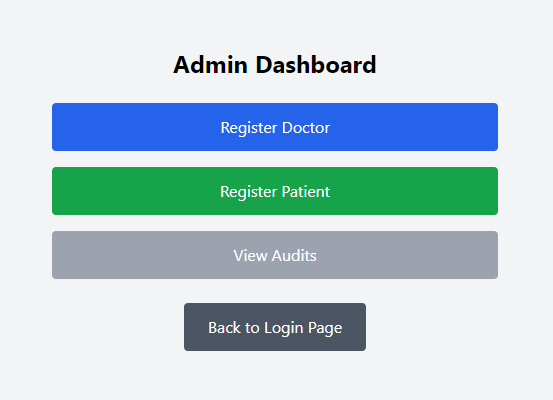
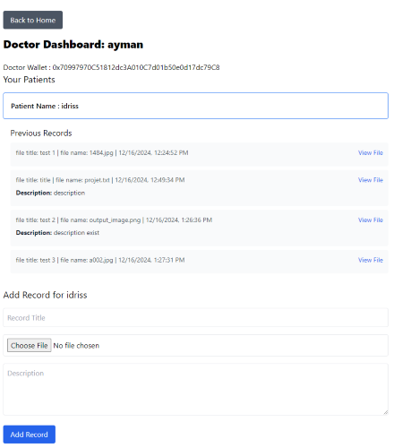
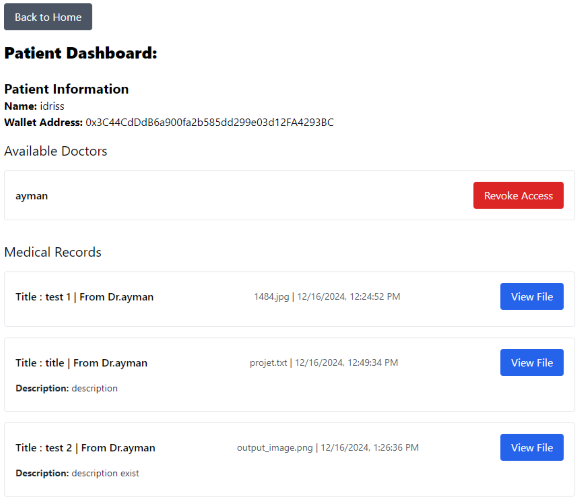

# ReactJS App

## functionalities : 

- admin : 
    - autentificatien (the owner of the contract)
    - can add doctor or patient to the blockchain using it account

- doctor : 
    - autentificatien
    - can add new medical File
    - can read the medical File

- patient :
    - autentificatien 
    - can only view his medical folder
    - can autorize the doctor 

---

## Running The React Application

### Prerequisites
- Node.js (v16 or later)
- npm or yarn

### Steps
1. Install to the Depandencis 
   ```bash
   git clone https://github.com/drisskhattabi6/Medical-Record-With-Blockchain.git
   cd 'Web App'
   ```

2. Install the deppendencies:
   ```bash
   npm install
   ```

3. Start the development server:
   ```bash
   npm start
   ```
   The app will be available at `http://localhost:3000/`.

## There are some screenshoots : 

Admin Page : 



Doctor Page : 



Patient Page : 

