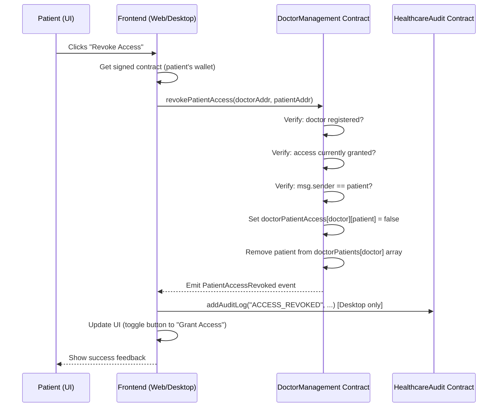

# Access Revocation: Patient Revoking Doctor Access

## Overview

Revocation allows a **patient** to remove a **doctor's** permission to view their medical records. This is a core privacy feature — only the patient can revoke, ensuring patient-centric control over data access.

The flow spans three layers: **Smart Contract** (on-chain logic) → **Frontend** (Web App / Desktop App) → **Audit Trail** (logging).

---

## Architecture



---

## Layer 1: Smart Contract — `revokePatientAccess()`

**File:** [doctorcontract.sol](file:///c:/Users/265660/Desktop/fyp/Medical-Record-With-Blockchain/blockchain/contracts/doctorcontract.sol#L50-L71)

### Data Structures Involved

| Structure | Type | Purpose |
|---|---|---|
| `doctorPatientAccess` | `mapping(address => mapping(address => bool))` | Tracks whether a doctor can access a specific patient |
| `doctorPatients` | `mapping(address => address[])` | List of patient addresses a doctor can access |

### Function Logic

```solidity
function revokePatientAccess(address _doctorAddress, address _patientAddress) external {
    // Guard 1: Doctor must exist
    require(doctors[_doctorAddress].isRegistered, "Doctor not registered");
    // Guard 2: Access must currently be granted
    require(doctorPatientAccess[_doctorAddress][_patientAddress], "Access not granted");
    // Guard 3: ONLY the patient can revoke their own access
    require(msg.sender == _patientAddress, "Only patient can revoke access");
    
    // Step 1: Flip the access flag
    doctorPatientAccess[_doctorAddress][_patientAddress] = false;
    
    // Step 2: Remove patient from the doctor's patient list (swap-and-pop)
    address[] storage patients = doctorPatients[_doctorAddress];
    for (uint i = 0; i < patients.length; i++) {
        if (patients[i] == _patientAddress) {
            patients[i] = patients[patients.length - 1];
            patients.pop();
            break;
        }
    }
    
    // Step 3: Emit event for off-chain tracking
    emit PatientAccessRevoked(_doctorAddress, _patientAddress);
}
```

### Key Security Properties

- **Patient-only revocation** — `msg.sender == _patientAddress` ensures no one else (not even the admin) can revoke on behalf of a patient
- **Idempotency protection** — `require(doctorPatientAccess[...])` prevents revoking already-revoked access
- **Array cleanup** — uses swap-with-last-and-pop pattern, which is O(n) but avoids leaving gaps

---

## Layer 2: Web App (React)

**File:** [patientpage.js](file:///c:/Users/265660/Desktop/fyp/Medical-Record-With-Blockchain/Web%20App/src/components/patientpage.js#L147-L163)

### How It Works

1. On the **Patient Dashboard**, all registered doctors are listed
2. Each doctor shows current access status (checked via `isAuthorized()`)
3. If access is granted → a red **"Revoke Access"** button appears
4. Clicking the button:
   - Gets a **signed contract** instance (connects the patient's MetaMask wallet as signer)
   - Calls `signedDoctorContract.revokePatientAccess(doctorId, patientId)`
   - Waits for the transaction to be mined
   - Updates local React state to toggle the button back to "Grant Access"

```javascript
const revokeAccess = async (doctorId) => {
    try {
        const { doctorContract: signedDoctorContract } = await getSignedContracts();
        const tx = await signedDoctorContract.revokePatientAccess(doctorId, id);
        await tx.wait();
        setDoctors(doctors.map(d => 
            d.id === doctorId ? { ...d, hasAccess: false } : d
        ));
    } catch (err) {
        alert('Error granting access: ' + err.message);
    }
};
```

> [!WARNING]
> The Web App does **not** log revocation to the audit contract. This is a gap — see [improvements.md](file:///C:/Users/265660/.gemini/antigravity/brain/6e129eaa-fd92-4d8a-8065-0b7dfb46d408/improvements.md).

---

## Layer 3: Desktop App (Python/CustomTkinter)

**File:** [main.py](file:///c:/Users/265660/Desktop/fyp/Medical-Record-With-Blockchain/Desktop%20App/main.py#L1294-L1325)

### How It Works

1. On the **Patient Page**, each doctor is shown with either "Grant Access" or "Revoke Access"
2. Access status is checked via `isAuthorized()` on the smart contract
3. Clicking "Revoke Access":
   - Builds a raw transaction calling `revokePatientAccess()`
   - Signs the transaction with the **patient's private key** (stored locally in `users.json`)
   - Sends the transaction and waits for receipt
   - Logs to audit contract as `ACCESS_REVOKED` ✅
   - Refreshes the patient page

```python
def revoke_doctor_access(self, doctor_address, patient_address, patient_private_key):
    transaction = self.doctor_contract.functions.revokePatientAccess(
        doctor_address, patient_address
    ).build_transaction({
        'from': patient_address,
        'nonce': self.w3.eth.get_transaction_count(patient_address),
        'gas': 2000000,
        'gasPrice': self.w3.eth.gas_price
    })
    signed_txn = self.w3.eth.account.sign_transaction(transaction, patient_private_key)
    tx_hash = self.w3.eth.send_raw_transaction(signed_txn.raw_transaction)
    receipt = self.w3.eth.wait_for_transaction_receipt(tx_hash)
    
    if receipt.status == 1:
        self.add_audit_log(patient_address, "ACCESS_REVOKED", doctor_address,
                          "Patient revoked doctor's access", patient_private_key)
        return True, "Access revoked successfully!"
```

---

## What Happens After Revocation?

| Effect | Description |
|---|---|
| **Doctor loses patient listing** | The doctor's `getAuthorizedPatients()` no longer returns this patient |
| **Doctor can't add records** | The doctor dashboard only shows authorized patients, so the doctor can no longer select this patient to add records |
| **Existing records remain** | Medical records already created by the doctor are **not deleted** — they remain on IPFS and the blockchain. The patient can still view them. |
| **Re-granting is possible** | The patient can click "Grant Access" again, which calls `addPatientAccess()` to restore access |

---

## Comparison: Web App vs Desktop App

| Feature | Web App | Desktop App |
|---|---|---|
| Revoke UI | ✅ Red button per doctor | ✅ Red button per doctor |
| Smart contract call | ✅ `revokePatientAccess()` | ✅ `revokePatientAccess()` |
| Signing method | MetaMask wallet (browser) | Private key from `users.json` |
| Audit logging | ❌ Missing | ✅ Logs `ACCESS_REVOKED` |
| Confirmation dialog | ❌ None | ❌ None |
| Loading/spinner | ❌ None | Status label shown |
